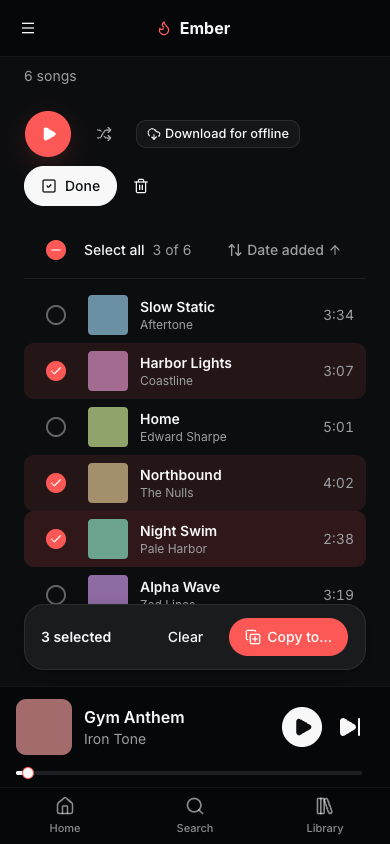
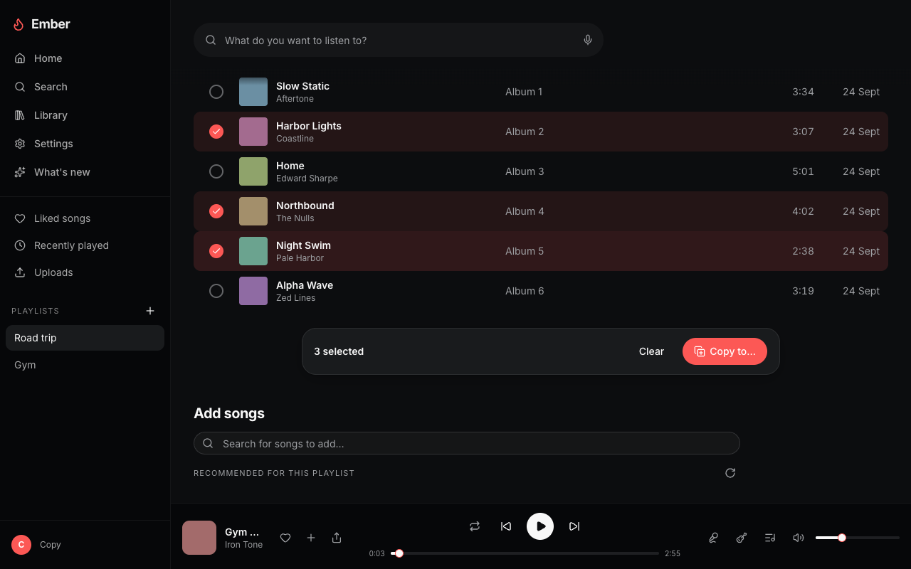
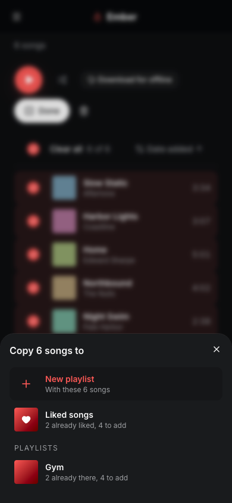
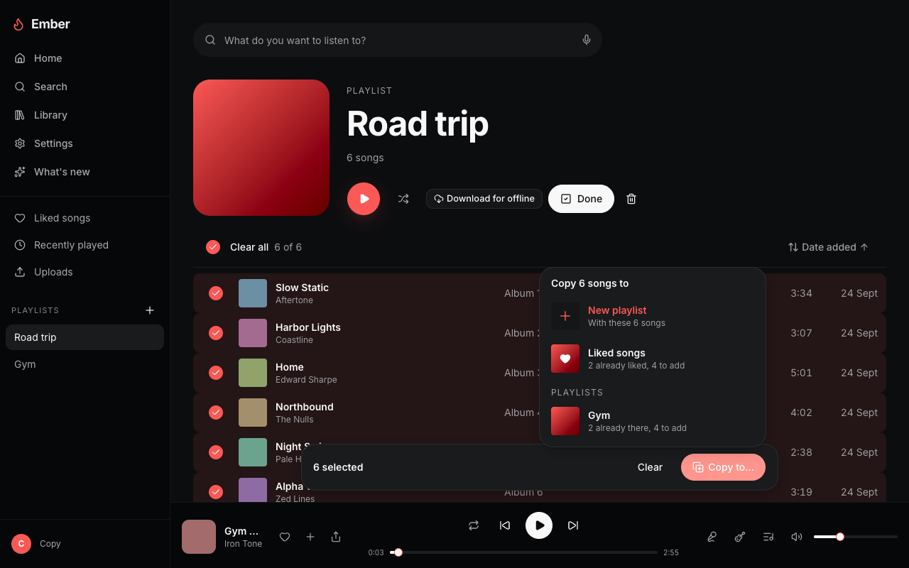
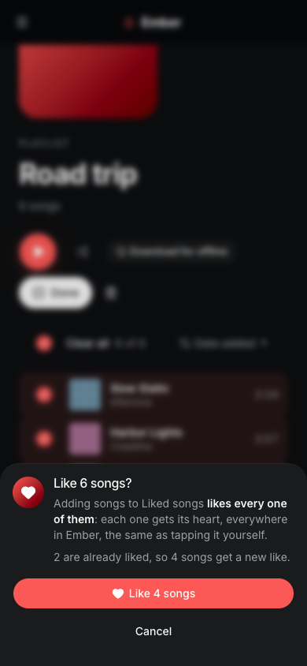
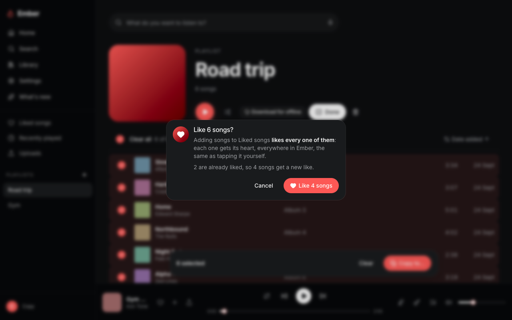
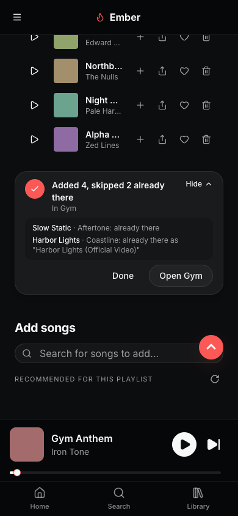
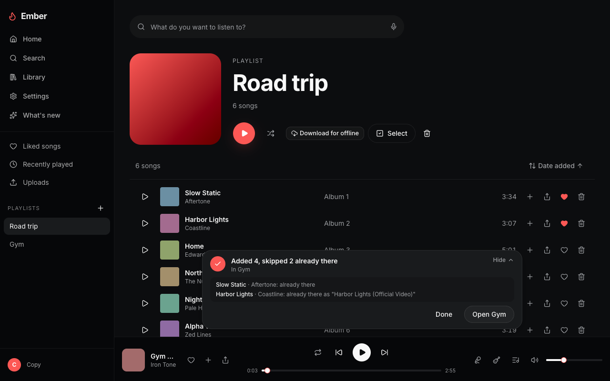

# Copy songs between playlists (0.7.3)

Design (a), the checkbox column, built into the real playlist page and Liked
songs. A fresh member with "Road trip" (6 songs) and "Gym" (4), sharing one
song by id, one as another upload (Harbor Lights vs "Harbor Lights (Official
Video)" by "Coastline - Topic") and a same-title pair by different artists
("Home" by Edward Sharpe and by Phillip Phillips). Slow Static and the Harbor
Lights video are liked already. A song sits in the player bar. Screenshots by
`tests/playlist-copy-ui.test.mjs` with `SHOT_DIR`, deviceScaleFactor 1.

| | Phone (390x844) | Desktop (1280x800) |
|---|---|---|
| Select mode, 3 picked |  |  |
| Copy to… |  |  |
| Liked songs warning |  |  |
| Result, Which? open |  |  |

How it works:

- Select (action bar) turns the play column into tick boxes; the row itself
  toggles too, and nothing plays or opens while selecting. Above the list:
  Select all / Clear all with "N of M", and Sort.
- Sort works without selecting: title, artist, date added, duration, both
  ways, remembered per playlist on this device (`ember-sort:<id>`). The
  default is the collection's own order. Play and Shuffle follow the order on
  screen.
- The bar sticks to the bottom of the page scroller, so it never covers the
  player bar or the phone nav; Back to top steps up over it.
- Copy to… lists New playlist (named inline), Liked songs, then the other
  playlists, each with "N already there, M to add". Liked songs asks first:
  "Adding songs to Liked songs likes every one of them", with how many are
  already liked and a "Like M songs" button.
- Duplicates use the Liked hearts' rule (`findLikedVariant`, `lib/songKey`):
  the same id or another upload of the same song is skipped; the same title
  by a different artist, a live/remix/instrumental version, and songs with no
  artist are not. The same song picked twice goes in once. The server
  re-checks (`POST /api/playlists/[id]/tracks/bulk`, `POST /api/likes/bulk`,
  which refuses without `confirmed: true`), so the result is what it did.

Checked by `tests/playlist-copy-ui.test.mjs` (96 checks at 390 and 1280) and
the unit tests in `lib/playlistCopy.test.ts`, the two route tests,
`hooks/useTrackSelection.test.tsx`, `hooks/useCollectionSort.test.tsx`,
`components/track/menus/CopySongsBar.test.tsx`,
`components/library/CollectionPage.test.tsx` and
`components/track/TrackRow.test.tsx`.
