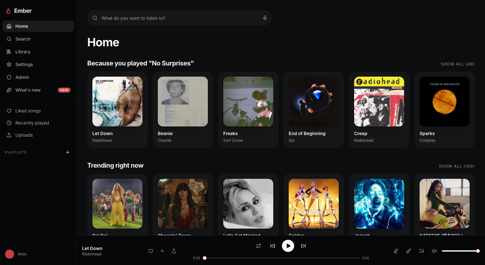
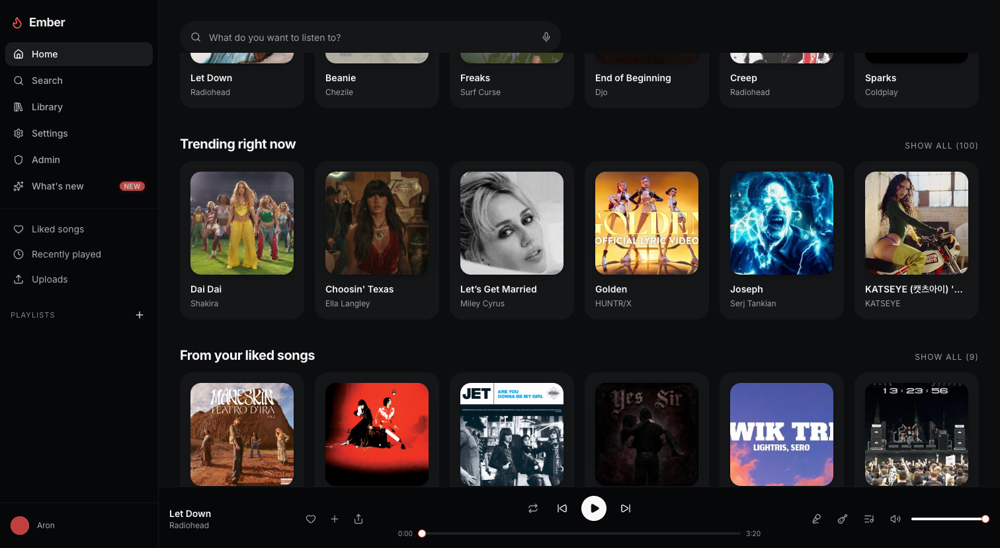
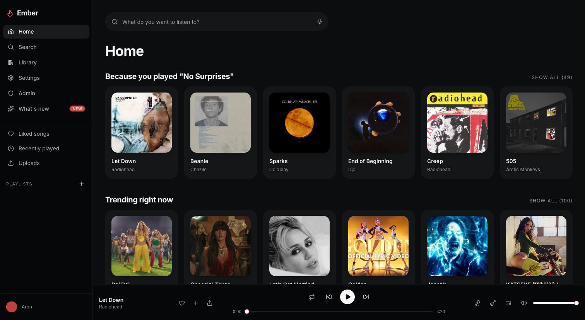
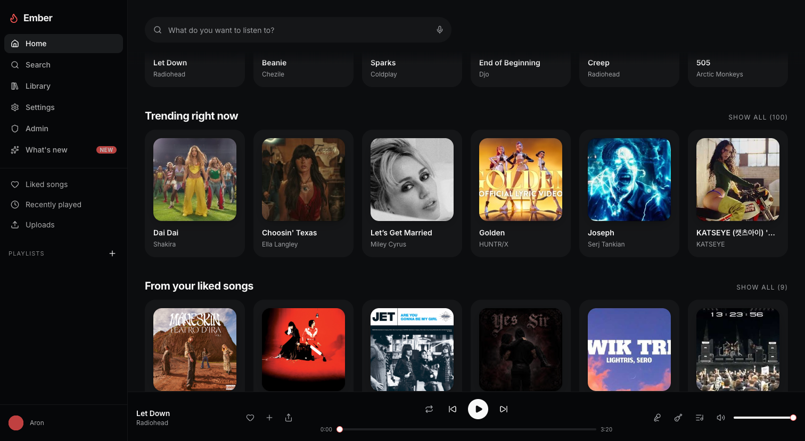

# Desktop top bar: the floating pill (0.7.1)

Home at 1512x830, the seed user, a song in the player bar. Before is main at
d73ec07 (0.7.0), after is `release-topbar`. Scrolled is 300px.

| | Top | Scrolled |
|---|---|---|
| Before |  |  |
| After |  |  |

What changed:

- The search bar is `sticky top-0` inside the page scroller
  (`components/nav/DesktopTopBar.tsx`), so the scrollbar now starts at the
  top of the main column instead of 80px down.
- At scroll top nothing moves: pill bottom 80px and Home heading 112px from
  the top of the column, before and after, at 1280, 1512 and 1920. The
  scroll range is the same too (no extra gap).
- Scrolled, the page background covers the bar and a 16px band under the
  pill, then a 24px fade. Before, cover art ran right up to the pill.
- Phones (390x844) are unchanged: same heading position, same scroll range.

The lyrics panel, the search panel's height cap, the tabs toolbar and the
Appearance preview all read the bar's height from `--ember-topbar-h`.
Checked by `tests/topbar-ui.test.mjs` (70 checks), with
`tests/appearance-fit-ui.test.mjs` and `tests/themes-ui.test.mjs` still
passing.
